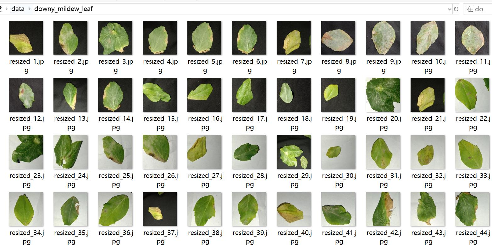
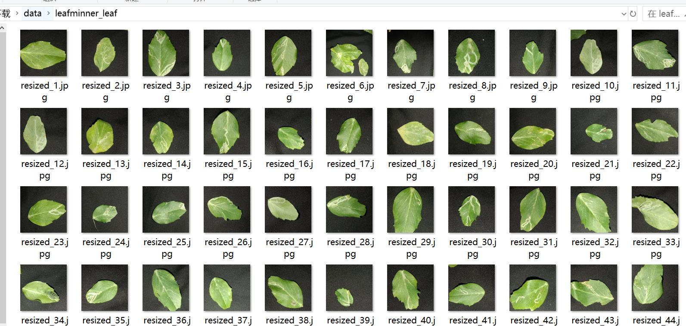
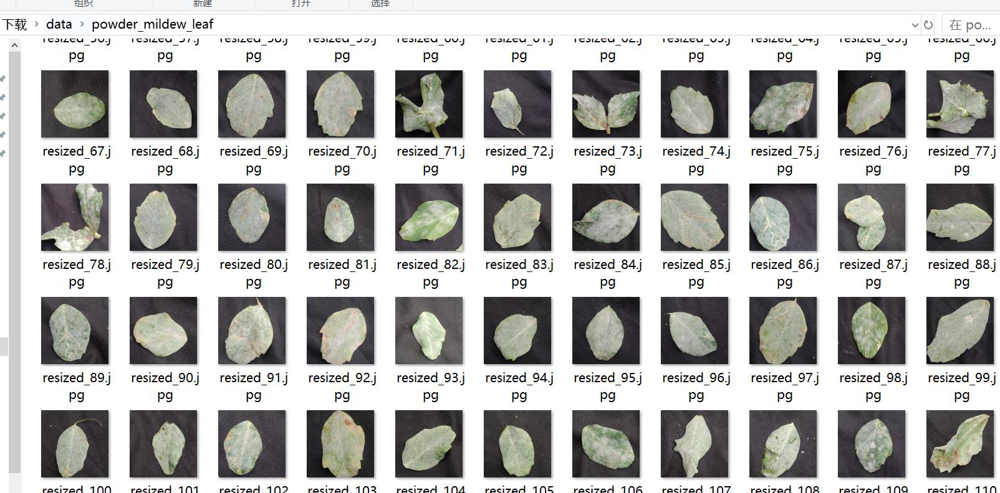

# Pea Leaf Leaves Disease and Pest Image Classification Dataset 1432 Images in 4 Categories

Dataset Type: Image classification for use, not suitable for target detection without labeled files
Dataset Format: Only contains jpg images, each category folder contains corresponding images
Number of Images (JPG file count): 1432
Number of Categories: 4
Category Names: ["downy_mildew_leaf", "fresh_leaf", "leafminner_leaf", "powder_mildew_leaf"]
Image Count per Category:
downy_mildew_leaf (Potato Phthoridia Leaf) Image Count: 366
fresh_leaf (Fresh Leaves) Image Count: 411
leafminner_leaf (Leaf Miner) Image Count: 348
powder_mildew_leaf (White Mildew Leaf) Image Count: 307
Image Resolution: 256x256
Important Notes: None
Special Disclaimer: This dataset does not guarantee the accuracy or reasonable classification of trained models or weight files. The dataset only provides accurate and reasonable classification 
storage.
Image Preview:

## Image

Here is a pay link on Stripe ( https://buy.stripe.com/3cs8yP7sY87d0vu9AB ). Please contact me lonlonago@foxmail.com after funding $89, and I will send you a complete data files , thank you!

